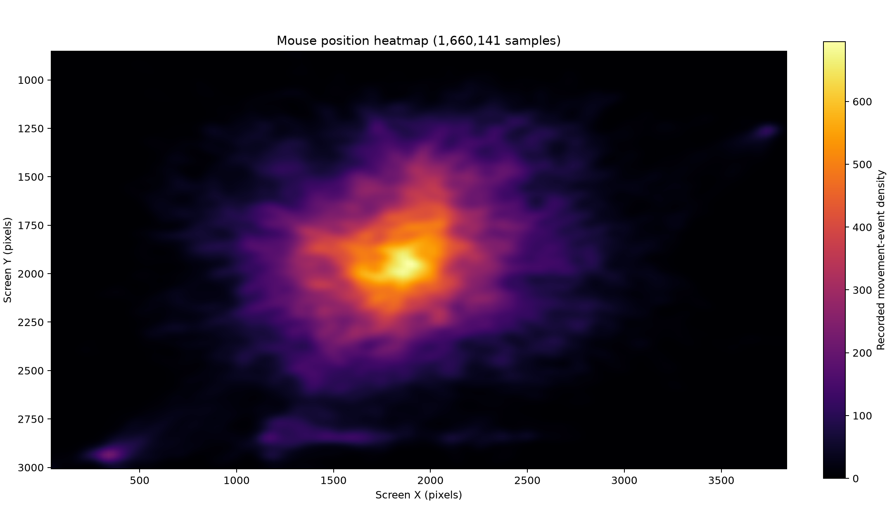

# Mouse Position Heatmap

> This project was vibecoded. Review the code before using it.

A local Python program that records global mouse positions into SQLite, then creates heatmaps, movement statistics, and CSV exports. Data stays on your computer.

## Demo



*Mouse movement recorded during a game of Supreme Commander: Forged Alliance Forever.*

## Install

Python 3.10 or newer is required. Run the installer once:

```bash
./install.sh
```

It creates a private `.venv`, installs the project, and links `mouse-heatmap` into `~/.local/bin`. You do not need to activate the virtual environment. If that directory is not already on your `PATH`, the installer prints the line to add to your shell configuration.

To update the installation after pulling code changes, run `./install.sh` again.

## Record positions

```bash
mouse-heatmap record
```

Move the mouse normally and press `Ctrl+C` when finished. By default, the program saves every movement event reported by the operating system to `mouse_positions.sqlite`.

Give the recording an optional tag as the first argument when you want to combine it with similar sessions later:

```bash
mouse-heatmap record foobar
```

Useful options:

```bash
# Stop a tagged recording automatically after one hour
mouse-heatmap record work --duration 3600 --label "morning session"

# Limit recording to at most one point every 20 ms
mouse-heatmap record --sample-ms 20

# Use a different database
mouse-heatmap record --db ~/tracking/mouse.sqlite
```

A nonzero sample interval keeps the database much smaller during long recordings. It does not interpolate or invent positions.

## Analyze recordings

List sessions and their IDs:

```bash
mouse-heatmap sessions
```

Delete one or more sessions, including all of their recorded positions, with `delete` or its `rm` alias:

```bash
mouse-heatmap sessions delete 3 5
mouse-heatmap sessions rm 8
```

Every ID is validated before deletion, so an unknown ID will not cause a partial deletion. Deletion is permanent.

Create a heatmap from the most recent session:

```bash
mouse-heatmap heatmap
```

The default output name is the current UTC time in RFC 3339 format, such as `2026-09-12T20:15:30Z.png`. Override it when needed:

```bash
mouse-heatmap heatmap --output mouse_heatmap.png
```

Pass `--session` to analyze an older session. Repeat the option to combine sessions, use `--tag` to combine every session with a matching tag, or use `--all-sessions` (`-a`) to include every session:

```bash
mouse-heatmap heatmap --session 3 --output session-3.png
mouse-heatmap heatmap --session 2 --session 3 --bins 240 --smoothing 2
mouse-heatmap heatmap --tag foobar --output foobar.png
mouse-heatmap heatmap --all-sessions
```

Tag matching is case-insensitive. The `sessions` command shows each session's tag. To set or replace the tag on existing sessions, pass one or more session IDs:

```bash
mouse-heatmap tag foobar 3 5 8
```

The command validates every ID before changing anything, so an unknown ID will not leave the selected sessions partially updated.

Open the finished image in your system's default image application:

```bash
mouse-heatmap heatmap --open
```

Show movement statistics:

```bash
mouse-heatmap stats
mouse-heatmap stats --session 3
```

The report includes sample count, coordinate bounds, distance traveled, estimated active time, and average and maximum speeds. Distances and speeds are in screen pixels. Gaps longer than one second count as idle; change the threshold with `stats --idle-gap SECONDS`.

Export raw data for a spreadsheet, R, pandas, or another analysis tool:

```bash
mouse-heatmap export --output mouse_positions.csv
mouse-heatmap export --session 3 --output session-3.csv
```

Every CSV row contains `session_id`, nanosecond Unix timestamp, timestamp in seconds, `x`, and `y`.

Run any command with `--help` for all options:

```bash
mouse-heatmap heatmap --help
```

## Desktop permissions

Global input access is controlled by the operating system:

- **macOS:** allow your terminal or Python under **Privacy & Security → Accessibility**.
- **Linux/X11:** the program must run inside the graphical session and have access to `DISPLAY`.
- **Linux/Wayland:** many compositors intentionally block global pointer monitoring. If recording does not work, log into an X11/Xorg session. Do not disable desktop security controls.
- **Windows:** normal desktop sessions usually work without extra setup, though endpoint security software may ask for approval.

## Privacy and storage

The program records only coordinates and timestamps, never keystrokes, window titles, screenshots, or network data. Precise pointer history can still reveal activity patterns, so protect or delete the SQLite and CSV files when you no longer need them.

Heatmaps represent the density of recorded movement events, not exact stationary dwell time: a pointer left still produces no new movement events. SQLite uses write-ahead logging while a recording is active, so temporary `-wal` and `-shm` files beside the database are normal. Each recording is a separate session. Heatmap generation streams samples in batches so large recordings do not have to be loaded fully into memory. Ctrl+C, SIGTERM, and SIGHUP trigger an orderly flush; a crash or forced SIGKILL can still lose the small batch currently being written.

## Development

```bash
MPLBACKEND=Agg python -m unittest discover -s tests -v
```
